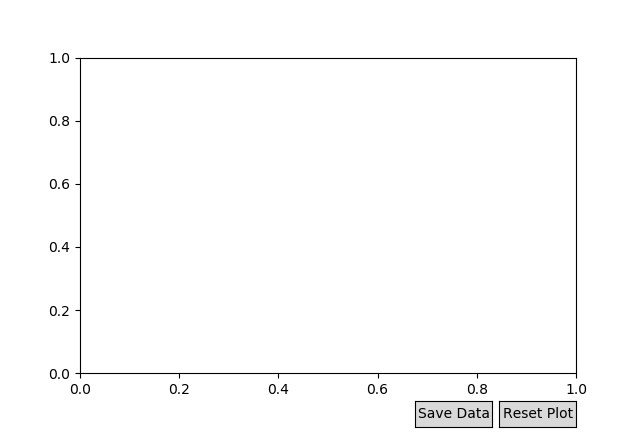

# Ludlum DAQ

## Description

A python script which reads data from a [Ludlum Model 2363 survey meter](http://ludlums.com/products/all-products/product/model-2363-with-42-41l)

##Requirements

* numpy
* matplotlib
* pyserial

## Usage

### Command Line

    usage: Ludlumdaq.py [-h] [-p PORT] [-f FILENAME]

    Read data from a Ludlum Model 2363 survey meter

    optional arguments:
      -h, --help            show this help message and exit
      -p PORT, --port PORT  The port to listen to
      -f FILENAME, --filename FILENAME
                            Name of data file

### GUI

Two histograms are displayed on this plot: Neutron dose and Gamma dose. These are updated each time the detector is queried. When the dose is 0 or greater than 100, it is not displayed, but it is saved to the output data file.

The Save Data button will save the data recorded to the current file, close it, and open a new one. The first file that is saved is set at the command line by -f FILENAME. After that, new files will be of the form FILENAME_x, where x increments everytime a new file is saved. The display is also reset.

The Reset Plot button clears the histograms